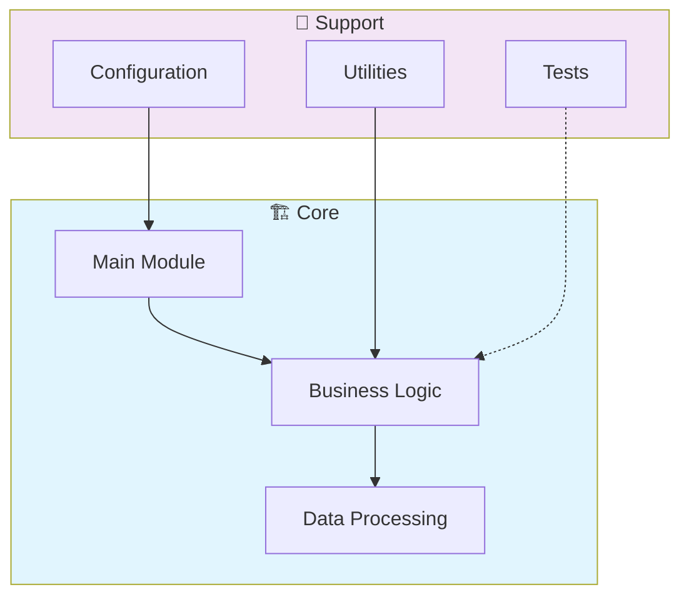

# 🚀 Task Management Platform

> Professional project by Gabriel Demetrios Lafis

[](https://img.shields.io/badge/)
[](https://img.shields.io/badge/)
[](https://img.shields.io/badge/)
[](LICENSE)

[English](#english) | [Português](#português)

---

## English

### 🎯 Overview

**Task Management Platform** is a production-grade JavaScript application complemented by CSS, HTML, R that showcases modern software engineering practices including clean architecture, comprehensive testing, containerized deployment, and CI/CD readiness.

The codebase comprises **5,896 lines** of source code organized across **58 modules**, following industry best practices for maintainability, scalability, and code quality.

### ✨ Key Features

- **🐳 Containerized**: Docker support for consistent deployment
- **📐 Clean Architecture**: Modular design with clear separation of concerns
- **🧪 Test Coverage**: Unit and integration tests for reliability
- **📚 Documentation**: Comprehensive inline documentation and examples
- **🔧 Configuration**: Environment-based configuration management

### 🏗️ Architecture



### 🚀 Quick Start

#### Prerequisites

- Node.js 20+
- npm or yarn

#### Installation

```bash
# Clone the repository
git clone https://github.com/galafis/Task-Management-Platform.git
cd Task-Management-Platform

# Install dependencies
npm install
```

#### Running

```bash
# Development mode
npm run dev

# Production build
npm run build
npm start
```

### 🧪 Testing

```bash
# Run all tests
npm test

# Run with coverage
npm run test:coverage

# Run in watch mode
npm run test:watch
```

### 📁 Project Structure

```
Task-Management-Platform/
├── public/
├── src/          # Source code
│   ├── assets/
│   ├── components/
│   │   └── ui/
│   ├── hooks/
│   │   └── use-mobile.js
│   ├── lib/
│   │   └── utils.js
│   ├── App.jsx
│   └── main.jsx
├── Dockerfile
├── LICENSE
├── README.md
├── analytics.R
├── app.js
├── components.json
├── eslint.config.js
├── jsconfig.json
├── package.json
├── pnpm-lock.yaml
└── vite.config.js
```

### 🛠️ Tech Stack

| Technology | Description | Role |
|------------|-------------|------|
| **JavaScript** | Core Language | Primary |
| **Docker** | Containerization platform | Framework |
| **React** | Frontend UI library | Framework |
| CSS | 3 files | Supporting |
| R | 1 files | Supporting |
| HTML | 1 files | Supporting |

### 🤝 Contributing

Contributions are welcome! Please feel free to submit a Pull Request. For major changes, please open an issue first to discuss what you would like to change.

1. Fork the project
2. Create your feature branch (`git checkout -b feature/AmazingFeature`)
3. Commit your changes (`git commit -m 'Add some AmazingFeature'`)
4. Push to the branch (`git push origin feature/AmazingFeature`)
5. Open a Pull Request

### 📄 License

This project is licensed under the MIT License - see the [LICENSE](LICENSE) file for details.

### 👤 Author

**Gabriel Demetrios Lafis**
- GitHub: [@galafis](https://github.com/galafis)
- LinkedIn: [Gabriel Demetrios Lafis](https://linkedin.com/in/gabriel-demetrios-lafis)

---

## Português

### 🎯 Visão Geral

**Task Management Platform** é uma aplicação JavaScript de nível profissional, complementada por CSS, HTML, R que demonstra práticas modernas de engenharia de software, incluindo arquitetura limpa, testes abrangentes, implantação containerizada e prontidão para CI/CD.

A base de código compreende **5,896 linhas** de código-fonte organizadas em **58 módulos**, seguindo as melhores práticas do setor para manutenibilidade, escalabilidade e qualidade de código.

### ✨ Funcionalidades Principais

- **🐳 Containerized**: Docker support for consistent deployment
- **📐 Clean Architecture**: Modular design with clear separation of concerns
- **🧪 Test Coverage**: Unit and integration tests for reliability
- **📚 Documentation**: Comprehensive inline documentation and examples
- **🔧 Configuration**: Environment-based configuration management

### 🏗️ Arquitetura


### 🚀 Início Rápido

#### Prerequisites

- Node.js 20+
- npm or yarn

#### Installation

```bash
# Clone the repository
git clone https://github.com/galafis/Task-Management-Platform.git
cd Task-Management-Platform

# Install dependencies
npm install
```

#### Running

```bash
# Development mode
npm run dev

# Production build
npm run build
npm start
```

### 🧪 Testing

```bash
# Run all tests
npm test

# Run with coverage
npm run test:coverage

# Run in watch mode
npm run test:watch
```

### 📁 Estrutura do Projeto

```
Task-Management-Platform/
├── public/
├── src/          # Source code
│   ├── assets/
│   ├── components/
│   │   └── ui/
│   ├── hooks/
│   │   └── use-mobile.js
│   ├── lib/
│   │   └── utils.js
│   ├── App.jsx
│   └── main.jsx
├── Dockerfile
├── LICENSE
├── README.md
├── analytics.R
├── app.js
├── components.json
├── eslint.config.js
├── jsconfig.json
├── package.json
├── pnpm-lock.yaml
└── vite.config.js
```

### 🛠️ Stack Tecnológica

| Tecnologia | Descrição | Papel |
|------------|-----------|-------|
| **JavaScript** | Core Language | Primary |
| **Docker** | Containerization platform | Framework |
| **React** | Frontend UI library | Framework |
| CSS | 3 files | Supporting |
| R | 1 files | Supporting |
| HTML | 1 files | Supporting |

### 🤝 Contribuindo

Contribuições são bem-vindas! Sinta-se à vontade para enviar um Pull Request.

### 📄 Licença

Este projeto está licenciado sob a Licença MIT - veja o arquivo [LICENSE](LICENSE) para detalhes.

### 👤 Autor

**Gabriel Demetrios Lafis**
- GitHub: [@galafis](https://github.com/galafis)
- LinkedIn: [Gabriel Demetrios Lafis](https://linkedin.com/in/gabriel-demetrios-lafis)
